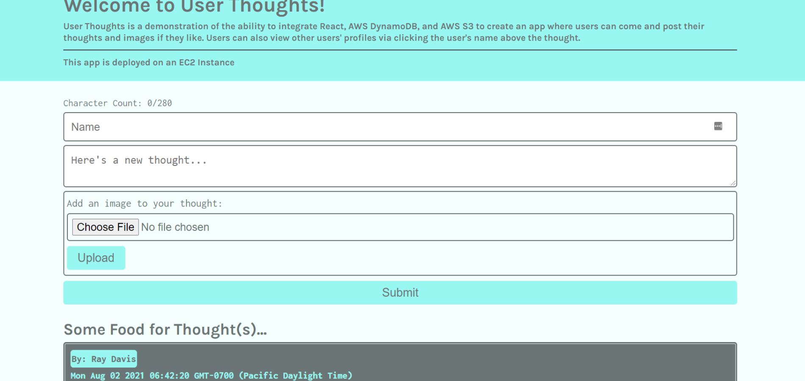

# AWS THOUGHT - 

This deployed app can be viewed <a href="http://18.191.138.198" target="_blank">Here</a>

    
    
    

  

    
    
    
    
    

## DESCRIPTION

Thought Experiment is a demonstration of the ability to integrate React, AWS DynamoDB, and AWS S3 to create an app where users can come and post their thoughts and images if they like. Users can also view other users' profiles via clicking the user's name above the thought. Thought Experiment is deployed on an AWS EC2 Instance.

## TABLE OF CONTENTS

- [Description](#description)
- [Installation](#Installation)
- [License](#License)
- [Usage](#Usage)
- [Credits](#Credits)
- [Contributing](#Contributing)
- [Tests](#Tests)
- [DevTeam](#Team)

## INSTALLATION

To install the dependencies necessary for this project, run the following command:

Please use `npm i` to install node dependencies

## LICENSE

- This project is licensed under the MIT license.

## USAGE

- This project requires Requires node v14+ to run.

## Credits

## CONTRIBUTING

## TEAM

Steve LeValley - Github: [sjlevalley](https://www.github.com/sjlevalley) 
